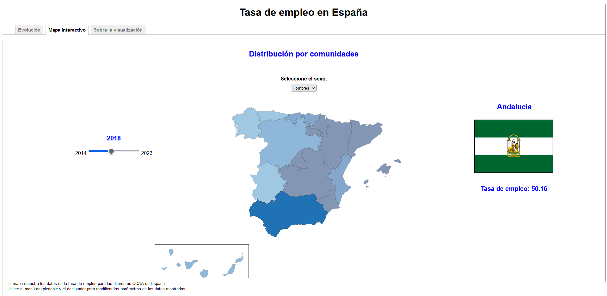

# Visualization Project with D3
### Created by: Pablo de Arriba Mendizábal

The main objective of this project is to learn how to use the D3 library in JavaScript for data visualization.

## Employment Rate in Spain

This project is a visualization created with D3, a very powerful tool that enhances the creation of charts, giving the user great creative freedom. This visualization aims to follow the evolution of the employment situation in Spain over the last 10 years, using the employment rate data provided by the [INE](https://www.ine.es/index.htm "INE") (National Statistical Institute in Spain).

## Visualization
This visualization consists of two charts. You can switch between them using the tabs in the top left corner.

#### Line Chart

The first one, the line chart, is the main component of the visualization. It will be the first chart displayed when the page loads. It represents the employment rate data for two age groups: under 25 years old and 25 years old or older. 
In this chart, the parameters can be modified in various ways. There will be two checkboxes, allowing the user to choose which lines to display on the chart, showing either both, one, or none. Additionally, there's a dropdown menu to select gender, displaying data corresponding to men or women, allowing for comparison.
A double-handled slider is also included, allowing the user to select the exact time interval of interest.

#### Interactive Map

The second component is an interactive map that will serve to compare the employment rate between the different regions based on color intensity. It is also equipped with elements to modify the parameters, such as a single-handled slider to select the year and a dropdown menu, as in the line chart, to select gender.
If you hover over any of the regions, it will be highlighted by fading out the color of the other regions. Additionally, the flag of that region and the employment rate value will be displayed on the right side of the map.

#### References
Some of the elements for modifying parameters come from the [jQuery](https://jquery.com/ "jQuery") library.
